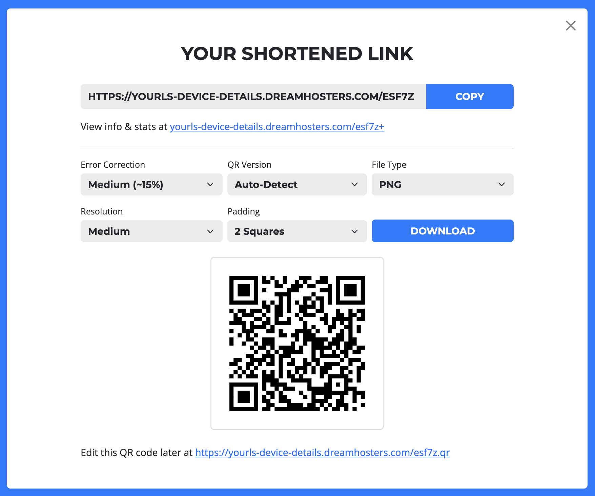

# Generate QR Code 

This plugin is loosely inspired by alexkolodko's YOURLS Local QR Code.  
Developed for Your Own URL Shortener ([YOURLS](https://yourls.org)) `v1.10.4` and above.

## Demonstration

Check it out on my own website: [yourls.dreamhosters.com](https://yourls.dreamhosters.com/).  
This plugin requires that the Sleeky frontend is installed, as this plugin injects code into the `index.php`.

## Usage

Once you click the 'Shorten' button, a screen will appear with your shortened link and a copy button.  
Below that will be a place where you can customize your QR code (see the options below) and download it.

Say that you forgot to download the QR code on that screen, do not worry.  
You can simply append `.qr` to the end of the shortened link.  
This will bring up a generation screen with the same options as before.

All generation takes place locally in the browser, and changes update live.

### Options

* **Error Correction**: The level of data redundancy to restore damaged codes. Options are L (\~7%), M (\~15%), Q (\~25%), and H (\~30%). *Default: M*
* **QR Version**: Controls the symbol's grid density. Can be set to Auto-Detect or locked between Version 1 and Version 10. *Default: Auto-Detect*
* **File Type**: The format of the output file. Supports PNG (transparent), JPG (solid white background), or SVG (scalable vector). *Default: PNG*
* **Resolution**: Sets the pixel density per module block (Low, Medium, or High) to control the final dimensions. *Default: Medium*
* **Padding**: Configures the quiet zone border around the code, selectable from 1 to 4 grid squares. *Default: 2 Squares*

## Installation
1. In `/user/plugins`, create a new folder named `generate-qrcode`.
2. Download the `plugin.php` and `qrcode.js` files from this repository.
3. Add both files into the newly created directory.
4. Go to the Plugins admin page (eg. `http://sho.rt/admin/plugins.php`) and activate it.

Alternatively, this plugin is compatible with both [Download Plugins](https://github.com/krissss/yourls-download-plugin) and [Download Delete](https://github.com/SachinSAgrawal/YOURLS-Download-Delete), so copy and paste the URL of this repository and set the branch to be `main` to install it.

## Contributors
Sachin Agrawal: I'm a self-taught programmer who knows many languages and I'm into app, game, and web development. For more information, check out my website or Github profile. If you would like to contact me, my email is [github@sachin.email](mailto:github@sachin.email).

## License
This package is licensed under the [MIT License](LICENSE.txt).